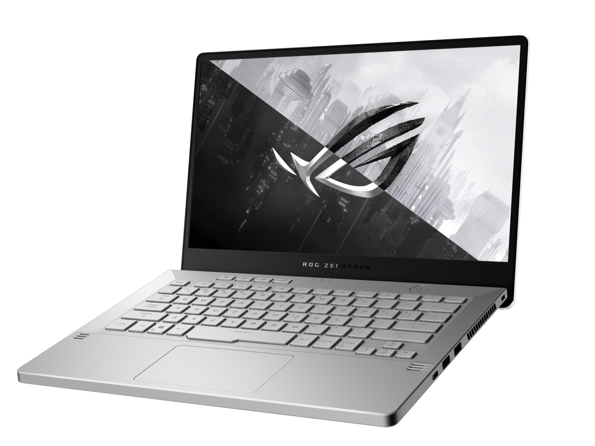

Name Section
Asus ROG Zephyrus G14 GA401IU-HE021T-BE AZERTY
Description section
The Asus ROG Zephyrus G14 GA401IU-HE021T-BE is a compact and lightweight gaming laptop. You can use it to play the latest multiplayer games such as Call of Duty: Warzone at high settings and at more than 60 frames per second. All of these frames are smoothly displayed on the screen, which has a 120Hz refresh rate. Thanks to the slim design and weight of just 1.6 kilograms, the Asus is very lightweight compared to other gaming laptops. This means you can take it with you in a backpack to LAN parties or friends. Is it getting a bit warm indoors? Thanks to the anti-glare screen, you won't be bothered by reflections and you can continue playing games outside on a sunny day. Even when it gets dark, you can keep gaming on the backlit keyboard.
Specifications section
ProcessorAMD: Ryzen 7 4800HS 8c/16t 8 x 2.9 - 4.2 GHz, Renoir-HS (Zen 2)
Graphics adapter: NVIDIA GeForce GTX 1660 Ti Max-Q
Memory: 16 GB  
Display: 14.00 inch 16:9, 1920 x 1080 pixel 157 PPI, glossy: no, 120 Hz
Storage: 1 TB SSD
Connections: 2 USB 2.0, 2 USB 3.0 / 3.1 Gen1, 1 HDMI, 1 DisplayPort
Networking: 802.11 a/b/g/n/ac/ax (a/b/g/n = Wi-Fi 4/ac = Wi-Fi 5/ax = Wi-Fi 6/), Bluetooth 5.0
Size: height x width x depth (in mm): 20 x 325 x 222 ( = 0.79 x 12.8 x 8.74 in)
Battery: 76 Wh
Additional features: Keyboard Light -> yes
Weight: 1.7 kg ( = 59.97 oz / 3.75 pounds)
Photos with desciptions section

*Asus ROG Zephyrus G14 GA401IU-HE021T*

